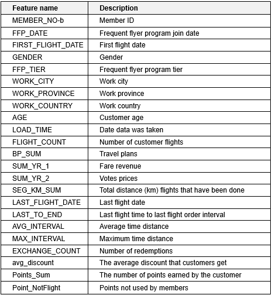
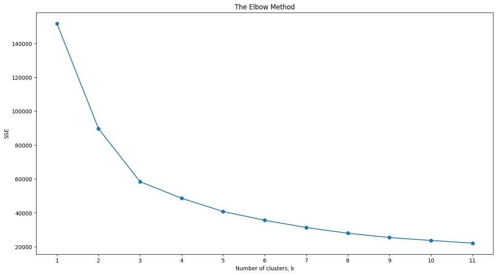
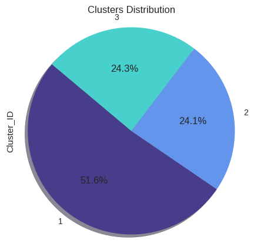
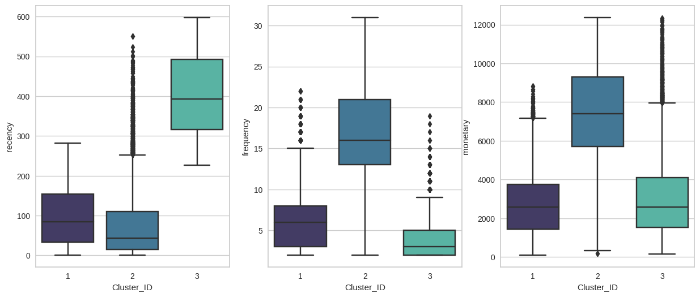
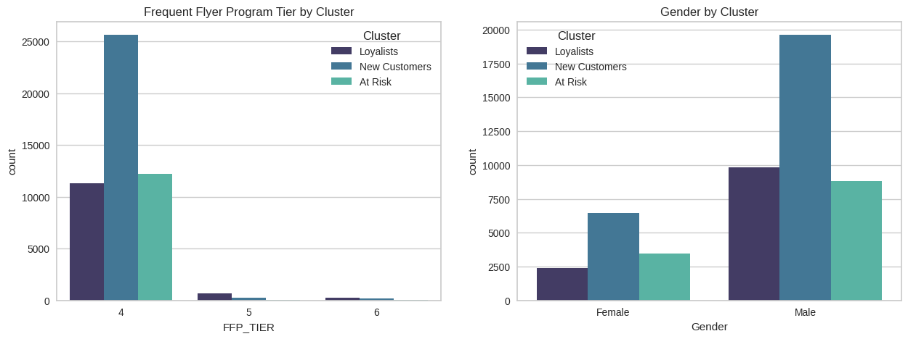
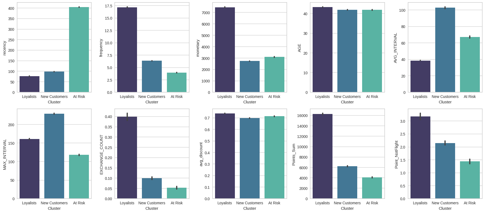

# Flight Member Segmentation with RFM Analysis
Customer segmentation is the process of dividing the customer base into different groups of individuals who have similar characteristics. With customer segmentation, you can easily adapt your marketing, service, and sales efforts to the needs of specific groups. The result is a potential boost to customer loyalty and conversions.

---

## Prerequisites
1. Download the dataset [here](https://www.kaggle.com/datasets/felixign/airline-customer?select=flight.csv)
2. Install packages with `pip install requirements.txt`

## Project Overview
In this project, I built customer segmentation based on the RFM value of each customer. The dataset that I got contains customer information, the following are all features of the customer dataset along with their explanations:

---

## RFM Analysis
RFM analysis is a marketing technique used to quantitatively sort and categorize customers based on the recency, frequency, and monetary total of their last transaction to identify the best customers and conduct targeted marketing campaigns.

After the data is cleaned, I determined the calculation of the RFM value taken from these columns:
*   `Recency`: `LAST_TO_END`
(Distance between the last flight and the last flight booked)
*   `Frequency`: `FLIGHT_COUNT`
(Number of customer flights)
*   `Monetary`: `SUM_YR_1`
(Fare revenue)

These new columns will be used as features for clustering.

## Clustering Results and Insights
I am using the K-means clustering method to build the clusters. The number of clusters is based on the results obtained from the process of determining the best number of clusters using the elbow method. The results showed that the cluster experienced a sharp decline at k=3.

The majority of members are in cluster 1 with a proportion of 52%, while clusters 2 and 3 have a proportion of approximately 24%.

The following is the distribution of RFM values for each cluster.

From the boxplot graph above it can be seen the characteristics of each cluster as follows:

* The first cluster has a fairly good recency value but the frequency of flights and income generated from members in this cluster is still not too high. I would name this cluster "New Customers" after seeing their last flight was still quite recent while the frequency is very low.

* The second cluster has a very good recency value as well as the highest frequency of transactions and income generated compared to other clusters. Members in this cluster are already in the "Loyalist" customer category.

* The third cluster has the highest recency value or members in this cluster have not used this service for a long time. Members in this cluster also use flight services the least and generate the second lowest income.
The characteristics of a member like this are suitable to be called an "At Risk" customer.

I then attached the cluster names to each customer so I can do a more in-depth analysis of the cluster based on other features.

From these graphs, we can tell:

* Based on the max_interval chart, new customers had longer flights compared to other clusters.
* New customers and At-risk customers rarely use their points which is in line with the total points left they have
* The average discount between clusters is quite the same
* At-risk customers are barely seen in frequent flyer program tiers 5 and 6.
* The age distribution between clusters is quite the same.

## Business Recommendation

1. Airline company can pay more attention or interact with the new members to increase their loyalty. It is also possible to carry out further analysis of the habits of members so that the service can be customized personally so that the member can increase the frequency and revenue of their transactions for example like short flights with good promotions dedicated to new members. Airline company may also consider differentiating the average discount given to loyalists so that new customers are more enticed to become loyalists.

2. For loyalist members, the airline company must maintain these members so that they continue to frequently use the service. To maintain member loyalty, the airline company can determine even more attractive rewards when exchanging membership points or points collection tactics by using strategic services to continue to spur members' desire to collect points. 

3. At-risk members may want to return if there are certain programs within the membership that match what they want. The airline should bring them back with relevant promotions or marketing strategies, or they can also survey these members by asking for flight reviews to find out the airline's service weaknesses.

 

